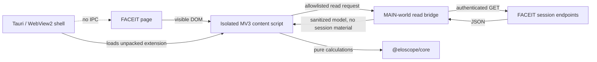

# EloScope architecture

## Trust boundaries

EloScope has three deliberately separate layers:

1. `src-tauri` owns the native window, WebView2 profile, navigation policy,
   updater and local diagnostics. The remote FACEIT page receives no Tauri
   capability and no IPC commands.
2. `extension/src/main` runs in the page's MAIN world. It may perform a small,
   versioned set of authenticated **GET** requests that the current FACEIT
   session is already allowed to make. It returns sanitized domain models only.
   Authorization headers, cookies and tokens stay inside the request closure.
3. `extension/src/content` runs in an isolated world. It owns all Shadow DOM UI,
   local settings and visible-DOM automation. It has no native capability.

`packages/core` is environment-independent and contains no browser or Tauri
code. Calculations are deterministic and fixture-tested.

## Failure policy

- Unknown routes, selectors or data shapes disable the affected feature.
- Read failures remain `loading`, `restricted`, `empty` or `error`; missing data
  is never converted to a fake zero.
- Automation operates only on a single, visible, enabled element matching a
  fixture-backed contract. Multiple matches are treated as ambiguous.
- A remote compatibility manifest can disable capabilities, never enable them.
- FACEIT remains fully usable when the extension is disabled.

## Storage

- WebView2's application profile stores FACEIT cookies/login in the normal
  encrypted browser profile.
- Extension storage contains preferences, non-sensitive statistics cache,
  historical ELO snapshots collected after installation and sent-message keys.
- Session tokens, cookie values and Authorization headers are never persisted.
- The cache is deduplicated, capped at four concurrent reads and 50 MiB LRU.

## Data freshness

| Data | TTL |
| --- | ---: |
| Player statistics | 5 minutes |
| Active match | 30 seconds |
| Finished match | 1 hour |

The UI may render cached data immediately with an explicit stale marker while a
background refresh is in progress.
